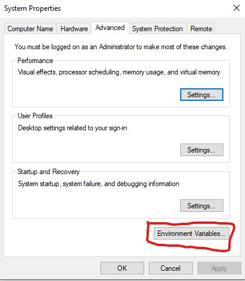
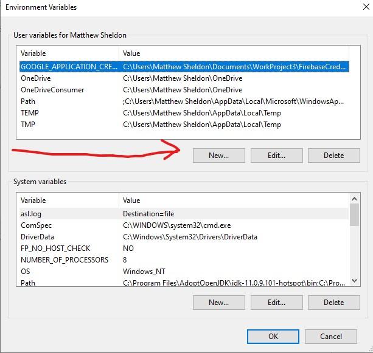
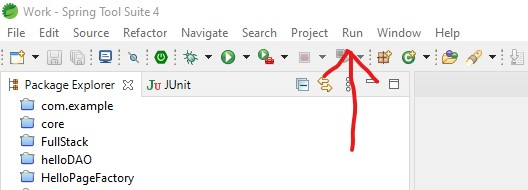
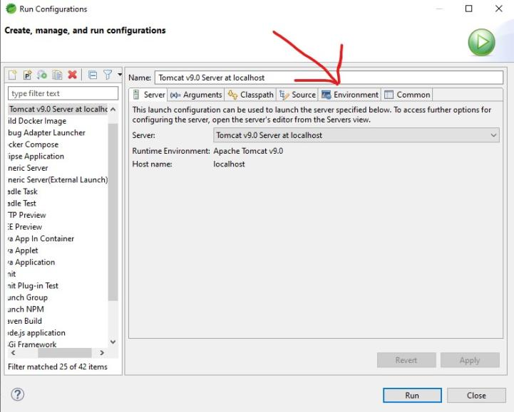
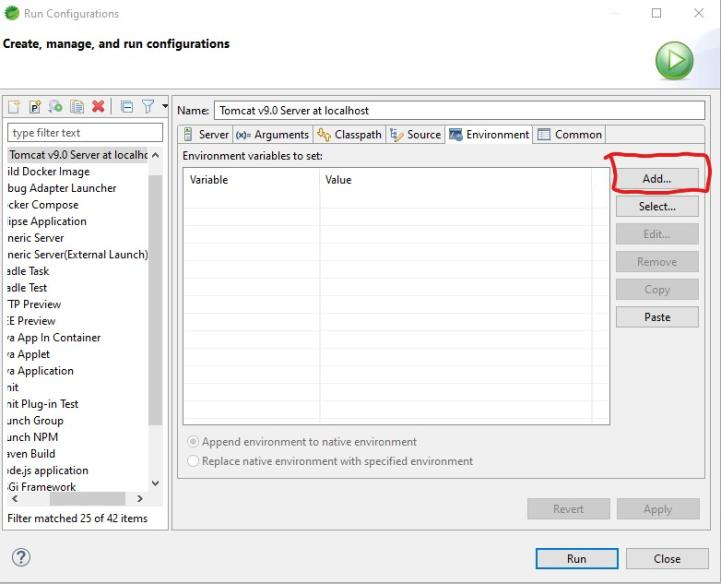
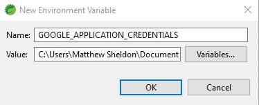
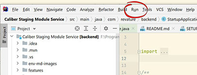
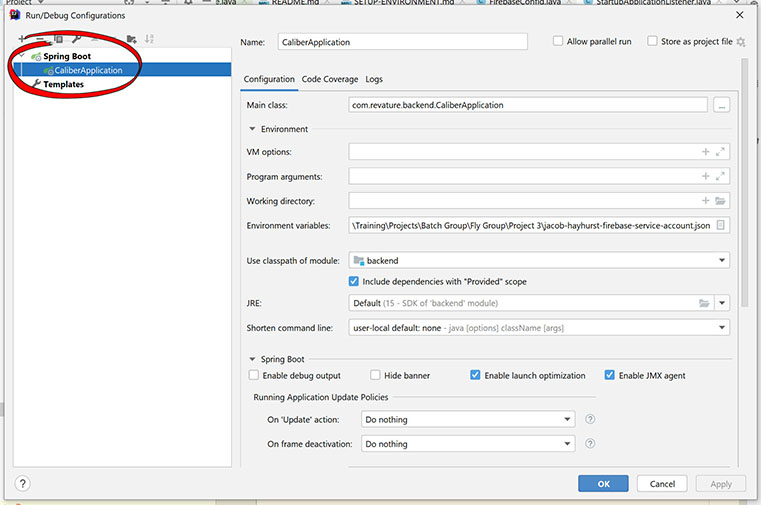
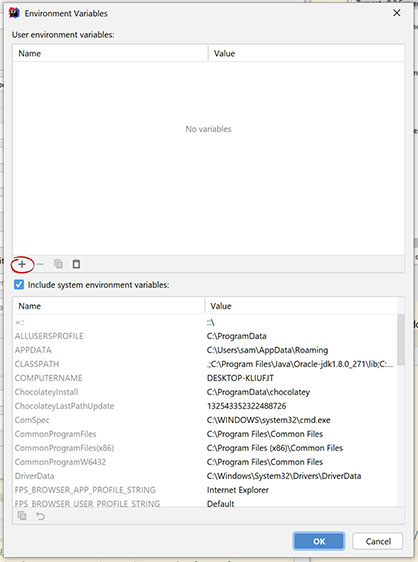

# Setup Environment for Firebase

## Windows

1. In the windows search bar type “environment.”

2. Click on the Edit the system environment variables.

3. That brings up this window. Now click on the button labeled Environment Variables

4. From here click on new under the section for user variables. And fill out the fields as shown filling in the second field with your file path, the file path will be the absolute path to where you downloaded the *service-account.json* if the folder has spaces you may need to wrap the value in quotation marks e.g.
   + C:\Users\username\Downloads\service-account.json
   + C:\Users\Jay\Desktop\my-private-keys\service-account.json
   + "C:\Users\Chris\projects\Folder with Spaces\service-account.json"

5. Click OK and restart your IDE of choice and run the server.

### -- Optional Temporary variable with Powershell --
#### This is only if you are running this for a single session, which probably is not what you're looking to do.

1. First open windows PowerShell.

2. Then enter the following command
`$env:GOOGLE_APPLICATION_CREDENTIALS=”C:\absolute\path\to\filename.json”`
where “path” is the absolute path to the service account credentials json file and file name is the name of the file.

**Troubleshooting for IDEs at the bottom**

## MacOS

1. Open Terminal

2. Run `run ~/.bash_profile`

3. Run `open ~/.bash_profile`

4. Type `export + env variable name=PATH`

5. `export GOOGLE_APPLICATION_CREDENTIALS= "/absolute/path/filename.json"` where “path” is the absolute path to the service account credentials json file and file name is the name of the file.

6. Save it (cmd+s) and Quit (cmd+q)

7. Run `source ~/.bash_profile`

8. To verify that it has been added, run `printenv` and check for GOOGLE_APPLICATION_CREDENTIALS being set to the path you specified to the service-account.json

9. Restart your IDE of choice and run the server.

**Troubleshooting for IDEs at the bottom**

## Linux

1. In order of preference you will open **one** of the following:
   1. .bashrc
   2. .bash_profile
   3. .profile

2. with your editor of choice:
   * vim
   * nano
   * emacs
   * sublime
   * atom

3. add `export GOOGLE_APPLICATION_CREDENTIALS=/absolute/path/to/service-account.json`

4. Save and close the file.

5. Source the file `source ~/.bashrc` or open a new terminal.

6. run the following `echo $GOOGLE_APPLICATION_CREDENTIALS` and you should see the path you specified to your service-account.json

7. Restart your IDE of choice and run the server.

**Troubleshooting for IDEs at the bottom**

## IDEs

### Spring Tool Suite

1. Open Spring Tool Suite.

2. Go to Run -> Run Configurations

3. Select the Environment tab

4. Click on Add

5. Fill out the fields as shown filling out the second field with your file path information

### IntelliJ IDEA

1. Open IntelliJ IDEA

2. Go to Run-> Edit Configurations...

3. Select Your Run Configuration.  This should be Spring Boot - CaliberApplication.

4. Click the Edit Environment Variables button.

4. Click the plus button to add a new environment variable.

5. Enter the appropriate values.  The path may contain spaces.  Do not surround the path with quotes.

### Other Resources

---

[Firebase Admin SDK setup](https://firebase.google.com/docs/admin/setup)
